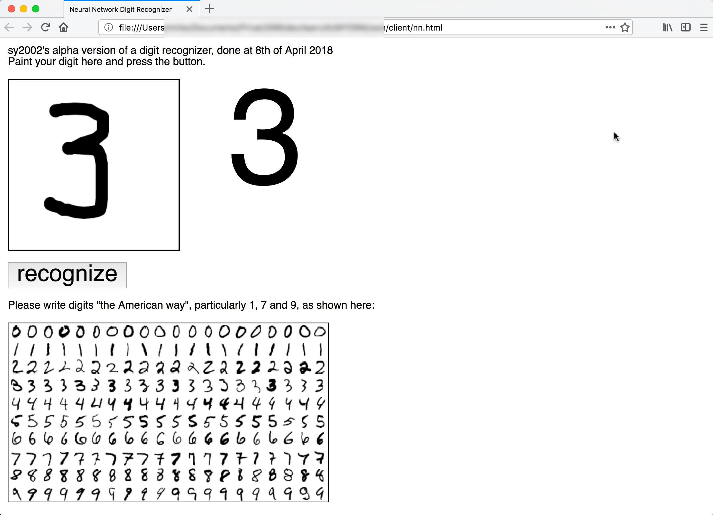

Handwritten Digits Recognizer using a Perceptron Network
========================================================

This project is a ready-to-go Python app that lets you learn more about
Neural Networks and Machine Learning in general and more about simple
Perceptron based handwritten digits recognition in particular.

The frontend is a HTML5/JavaScript client that allows you to paint the
digits on the screen. When you press the Recognize button, the Python Flask
backend receives the pixels via a REST call and returns the recognized digit.
The frontend then displays the recognized digit right next to the painted
version.



Try it online
-------------

Before installing, you can try it on [http://www.sy2002.de/nn.html](http://www.sy2002.de/nn.html).

Docker
------

Instead of installing manually you can use Docker, so your system including
your Python installation keeps untouched. 

Open a terminal window and execute the following command:

```
git clone https://github.com/sy2002/HWD-Perceptron.git
docker run -it -p 5000:5000 sy2002/hwd-perceptron
```

After your Docker container runs, skip forward to section
"[Running](#running)" for starting the client (HTML) in your web browser.

Installation
------------

You need `Python 3.6` (or newer) including `pip` and a bash shell on Mac OS,
Linux or Windows. On Windows this might be Cygwin or a
Linux Subsystem (Windows 10+).

Open a terminal window and execute the following commands:

```
git clone https://github.com/sy2002/HWD-Perceptron.git
cd HWD-Perceptron
./install.sh
```

The following things will happen during the installation:

1. The Python dependencies (such as numpy, scipy, ...) will be installed.

2. Data for training the Neural Network will be downloaded from the Internet.
   Check out [server/training/README.md](server/training/README.md) for 
   more details about the training data.

3. As a visual test, if the training data is valid, the bitmap graphics of
   three randomly picked digits will be painted to stdout (terminal) as
   ASCII art.

4. The Neural Network will be trained and as a result, the trained network
   will be saved as `server/saved_nn/test-epoch-1.npz`.

5. Finally, the recognition server is started. Leave the terminal window
   running and follow the steps in the next section.

### Troubleshooting

#### Installing inside a Docker container

If you are manually installing inside a Docker container, please make sure
that you run `./install.sh --host=0.0.0.0`, instead of `./install.sh`.

It is also important, that you are adding the port mapping parameter
`-p 5000:5000` when invoking Docker, so that the Docker internal port 5000
is mapped to your host and visible from within your host machine's web
browser.

#### Python 2 vs. Python 3 and Virtual Environment

On some systems, there are multiple versions of Python installed. Sometimes
Python 2 can be executed via `python` and Python 3 via `python3`. This
project expects, that running `python` and `pip` yields Python 3. If this
is not the case on your machine, then consider using a python
Virtual Environment.

A Virtual Environment is also useful when there are challenges with the
dependencies or collisions with other modules on your system. 

Here are the alternate installation instructions that install and run the
whole project in a Virtual Environment. Execute them instead of the
above-mentioned steps. It is assumed that your Python 3 is called `python3`
this time (versus `python` in the above-mentioned instructions). If your
Python 3 is called otherwise, then just use the appropriate name instead of
`python3` in the following steps.

```
git clone https://github.com/sy2002/HWD-Perceptron.git
cd HWD-Perceptron
python3 -m venv .
source bin/activate
./install.sh
```

#### Debian and Ubuntu

On Debian or Ubuntu systems, you may need to install the `python3-venv`
package using the following command before you run the above-mentioned
Virtual Environment installation instructions (you may need to use sudo with
that command):

```
apt-get install python3-venv
```

#### Manual installation of dependencies

If you run a clean or minimal Ubuntu 16.04 LTS, then you need to install
various dependencies manually, including `Python 3.6` because Ubuntu 10.04 LTS
is installing an older version 3.

[manual_dependencies.md](manual_dependencies.md) shows how to manually install
the necessary dependencies on Ubuntu 16.04 LTS.

Even if you use another Linux version, this might be helpful for you to see,
what you need to install.

Running
-------

If you used the Docker container or followed the above-mentioned manual
installation steps, then you should have the recognition server up and running
locally in your terminal window and you should see something like this:

```
  * Serving Flask app "hwdr_server"
  * Running on http://127.0.0.1:5000/ (Press CTRL+C to quit)
```

Hint: In Docker, the IP:Port is shown as 0.0.0.0:5000.

Since the trained network has been saved, you can also run the server after
the successful installation without the need to train it again.
Just execute `./run_server.sh` in a terminal window from the project's
root folder. If you are using a Virtual Environment, then don't forget to
execute `source bin/activate` before you run the server.

If you run inside a Docker container that you manually build, please make
sure that you run `./run_server.sh --host=0.0.0.0`.

In either case, leave the server's terminal window running and open a new
terminal window. Go to the project's root folder and execute
```./run_client.sh```. Your default web browser should open and show
a page that looks similar to the screenshot above. You can also open this
page manually; it is located at ```client/nn.html```.

Now you can start experimenting: Paint a digit and press the recognize button.
You should see the recognized number being printed. For the next digit,
just start painting over your first digit, the paint area will be cleared
automatically, when you paint your next digit.

How it works
------------

1. Using the MNIST dataset from LeCun et al. has become the "Hello World"
   example for Neural Networks and basic Machine Learning. Have a look at
   the folder
   [server/training](server/training/README.md#background-information)
   to learn more about that. The bottom line is, that the network is
   being trained using 28x28 pixels grayscale images.

2. The HTML5/JavaScript [client](client/nn.html) allows you to paint the digit
   inside a website. It supports desktop browsers as well as mobile touch
   devices. As soon as you press the Recognize button, your 280x280 pixels
   drawing is preprocessed to have an optimal similarity to the training
   data and then scaled down to 28x28 pixels. Have a look at the
   [client folder](client) to learn more about this. After the preprocessing,
   the client hands over the image via a REST API call to the Python server.

3. The Python [server](server/hwdr_server.py) offers one REST method called
   "recognize", which takes a long string of comma separated floating point
   values between -1 (black) and 1 (white). These values are representing the
   28x28 pixels as a parameter.
   The method returns the recognized digit between 0 and 9. By default, the
   above-mentioned installation runs the training script
   [hwdt.py](server/hwdt.py) which is initially configured to build a
   Perceptron network with 28x28 = 784 input nodes, 100 nodes in the hidden
   layer and 10 output nodes, one for the probability of each recognized
   digit. The heavy lifting is done inside the flexible Perceptron
   class [spnn.py](server/spnn.py). Browse the [server folder](server) and its
   README.md to learn more.

Tinkering
---------

### Manual installation vs. Docker

In case you installed the project manually, just navigate to the root folder
of the project to start tinkering. In case you used the Virtual Environment,
don't forget to enter `source bin/activate` before you start.

In case you used Docker, execute bash when starting the image and navigate
to /opt/HWD-Perceptron:

```
docker run -it -p 5000:5000 sy2002/hwd-perceptron /bin/bash
cd /opt/HWD-Perceptron
```

The manual start of bash as shown here is necessary within the `docker run`
command because otherwise, the default startup from the
[Dockerfile](Dockerfile) is used, which would immediately start up the server,
preventing you from tinkering.

For your system's web browser (outside Docker) being able to access the
server, you need to run it using `./run_server.sh --host=0.0.0.0` as described
above in the "[Running](#running)" section.

### Inspect the training data

As a first simple experiment: Inspect 25 random digits from the training data
and show them as ASCII art on your command line. The script is located at
the root folder of the project.

```
./show_data.py 25
```

Scroll back your terminal window to see the 25 ASCII arts that might look
similar to these examples.

```
=============================
              2
=============================
                            
                .--:+-      
             .+#%%%%%%+     
             +%%%=:::##:    
             =#-     .%+    
                      #-    
                      *+    
                      #.    
                     .*     
                     %-     
                     #.     
           ..      -#:      
       .#%##%-    =%+       
      +%%%%%%%#+-+%+        
     *%%*++=:+%%%%%-        
    +#=      :#%%%=*-       
    +*     .:@%#:  =#+      
    %*  :-=%%%#.     +#=    
    *%%+%%%%#:        :=    
    :%%%%#=.                
     .-+:                   
                              
=============================
              3
=============================
                            
          -*%%@#:           
          %%%%%%%.          
          %%:. :##          
          ..    :%=         
                :%+         
              . -%=         
            -+%#%#          
           +%%%%%.          
          .%%%%%%:          
          .%%#+.##          
           .:   :%:         
                 =*         
                 .%.        
                  %=        
                  +=        
        .=-       =+        
        *%*      :%*        
        .%%#=:==+%#.        
         .%%%%%%%%-         
           .*#+--           
```

### Manual processing of the client's output

The HTML5/JavaScript client prints the 28x28 pixels, converted to floating
point numbers between -1 (white) and 1 (black) to the browser's console.
By copy/pasting it from here, you can run a Python test script or manually
invoke the REST API of your server.

Here is a
[StackExchange Article](https://webmasters.stackexchange.com/questions/8525/how-do-i-open-the-javascript-console-in-different-browsers)
that explains how to open the browser's console.

#### Invoking the REST API manually

1. Open `nn.html` in your web browser, for example by using `./run_client.sh`.
   Make sure that your local server is *not* running as we want to invoke
   the REST API manually. 

2. Open the browser's console as described above.

3. Draw a digit and press the Recognize button: The error message "Error
   connecting to server!" is shown and you should now see a bunch of floating
   point numbers ranging from -1 to 1 in your console. Leave the browser
   window including the console open.

4. Open a new terminal window and start your local server as described
   above in "[Running](#running)".

5. Open a *new* browser window (leave the other one from step #3 open) and
   enter this link *without* pressing enter, yet:

   ```
   http://localhost:5000/recognize?imgdata=
   ```

6. Go back to the window from step #3 and select all the floating point
   numbers and COPY them.

7. PASTE the numbers in your new browser window from step #5 by appending
   them behind the `=` sign. Press enter/load the page.

8. You should see the REST API's response, which is Neuronal Networks's
   response to the digit, that you have drawn in the above-mentioned step #3.

#### Running the classification manually as Python script

1. You need to COPY the floating point number stream from the browser's
   console, so please execute the steps #1 to #3 and then #6 of the
   above-mentioned instructions.

2. Go to the file [server/test_cp.py](server/test_cp.py#L29) line 29 and
   comment out this line.

3. Add a new line directly after line 29:

   ```
   raw_input = [<PASTE>]
   ```

4. Replace `<PASTE>` by pasting the number stream you copied in step #1.

5. Go to the terminal, navigate to the server folder an run
   `python test_cp.py`. You should now see the digit you painted as ASCII
   art and you should see the output `Recognized:` followed by the
   correctly recognized digit.

### Increasing the recognition accuracy

For saving time during the installation process, only a suboptimally trained
network is being created. Training a network well takes significant time.

...

Experiment with better recognition rate, try XYZ file that is part of the
package:

Or train a better network by yourself by following these steps:

1. akd sdfkl lkj dfkslj 

2. dfjlskd fslkj dfkls f

3. sdkaslkdjasjlkd


