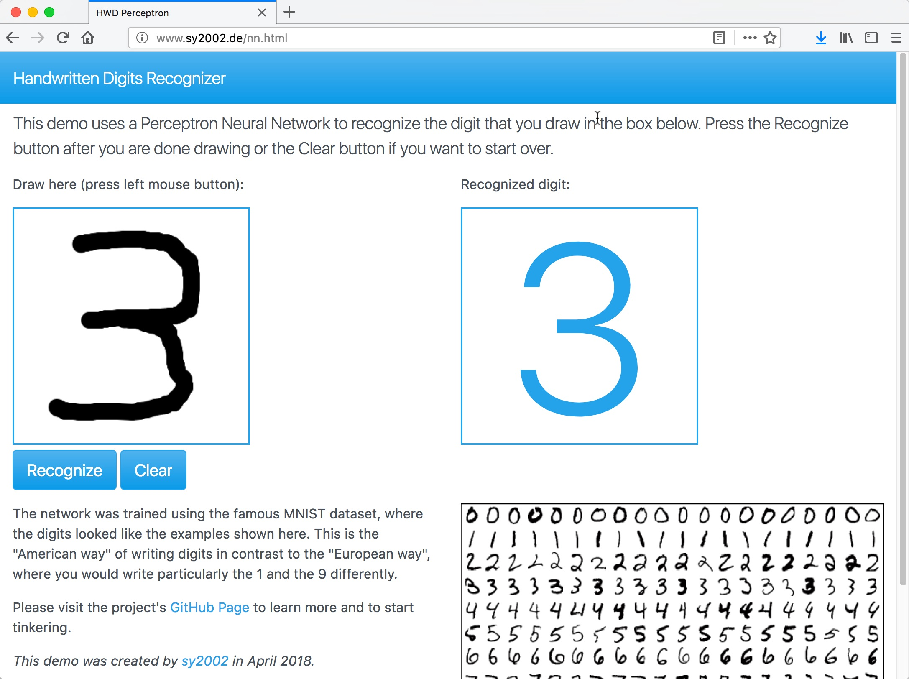

Handwritten Digits Recognizer using a Perceptron Network
========================================================

This project is a ready-to-go Python app that lets you learn more about
Neural Networks and Machine Learning in general and more about simple
Perceptron based handwritten digits recognition in particular.

The frontend is a HTML5/JavaScript client that allows you to paint the
digits on the screen. When you press the button, the Python Flask backend
receives the pixels via a REST call and returns the recognized digit.



Installation
------------

You need `Python 3` including `pip` and a bash shell on Mac OS, Linux or
Windows. On Windows this might be Cygwin or a Linux Subsystem (Windows 10+).

Open a terminal window and execute the following commands:

```
git clone https://TODOSETTHERIGHTPATH.com/hwdt
cd HWD-Perceptron
./install.sh
```

The following things will happen during the installation:

1. The Python dependencies (such as numpy, scipy, ...) will be installed.

2. Data for training the Neural Network will be downloaded from the Internet.
   Check out [server/training/README.md](server/training/README.md) for 
   more details about the training data.

3. As a visual test, if the training data is valid, the bitmap graphics of
   three randomly picked digits will be painted to stdout (terminal) as
   ASCII art.

4. The Neural Network will be trained and as a result, the trained network
   will be saved as `server/saved_nn/test-epoch-1.npz`.

5. Finally, the recognition server is started. Leave the terminal window
   running and follow the steps in the next section.

Running
-------

If you followed the above-mentioned steps, then you should have the
recognition server up and running locally in your terminal window and
you should see something like this:

```
  * Serving Flask app "hwdr_server"
  * Running on http://127.0.0.1:5000/ (Press CTRL+C to quit)
```

Since the trained network has been saved, you can also run the server after
the successful installation without the need to train it again.
Just execute ```./run_server.sh``` in a terminal window from the project's
root folder.

In either case, leave the server's terminal window running and open a new
terminal window. Go to the project's root folder and execute
```./run_client.sh```. Your default web browser should open and show
a page that looks similar to the screenshot above. You can also open this
page manually; it is located at ```client/nn.html```.

Now you can start experimenting: Paint a digit and press the recognize button.
You should see the recognized number being printed. For the next digit,
just start painting over your first digit, the paint area will be cleared
automatically, when you paint your next digit.

